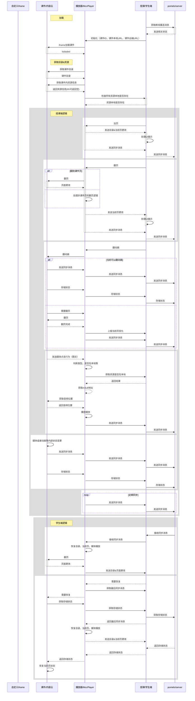
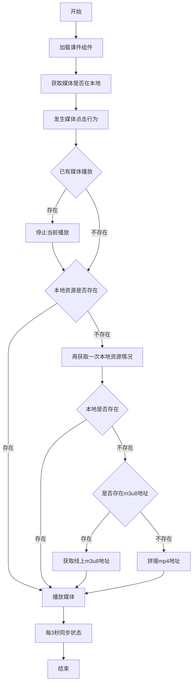

# 课件技术方案

## H5 课件优势

1. 呈现内容更丰富
2. 更多的动作同步，现在可以同步动画、TAB 标签、脑图、部分内容滚动等
3. 首页加载成功后，单页加载更快，翻页不存在白屏现象

## H5 课件已知问题

1. 同步 iframe 的内容需要按内容进行开发，工作量与内容成正比
2. 公共资源包变得更大

## 课件端需要的接口

### 广播

#### sendRoomItsMessage

发送消息

```ts
sendRoomItsMessage:(data: unknown) => void
```

#### handleRoomItsMessage

接收消息

```ts
handleRoomItsMessage(data:unknown)=>void
```

### 存取数据

#### storeData

存数据

```ts
storeData: (
  key: string,
  data: unknown,
  callback: (success: boolean) => void
) => void;
```

#### getStoreDataByKey

取数据

```ts
getStoreDataByKey: (key: string, callback: (data: unknown) => void) => void;
```

#### getAllStoredData

取存储的所有数据，返回一个 object，key 为所有存储的 key，value 则对应

```ts
getAllStoredData: (
  callback: (data: { [key: string]: unknown }) => void
) => void;
```

## 课件关键操作时序图



## 媒体播放流程图



## 确定的技术方案

1. 隐藏页逻辑：隐藏页要有（交互游戏挂在一个页上面，将页设置为隐藏），一期把所有隐藏页当作正常页处理，二期隐藏页在上下页中不展示
2. 媒体播放排他确定，媒体播放排他
3. 业务标签展示的问题，结论：拿不到不是相应业务的标签（不用关心这个问题）
4. 视频播放撑满，结论：撑满，H5 课件可手动切换
5. 音频动效问题（比如单词）结论：使用控制条展示还是外部展示，更改默认图标，通过外部的动效（可以不考虑四个角的问题）
6. 交互游戏（课件内部）可能存在学生来操作的情况，公共屏幕和私有屏幕的问题，一期，二期应该没有
7. 手机竖屏处理：只有横屏，pad 也只有横屏
8. 音量同步问题：各自调整，完全不用同步
9. 哪些操作同步：视频播放，暂停，seek
10. 视频控制条，老师端控制条使用 chrome 默认的
11. 学生端怎样展示视频控制条，结论：不用展示任何控制，包括音量
12. 暂时没有课件多开需求，多开由上层隔离环境即可
13. 目录和当前也同步、课件的同步、媒体的同步走同一个接口

## 参考资料

[课件内 iframe 同步规范](https://wiki.zhiyinlou.com/pages/viewpage.action?pageId=93693902)
